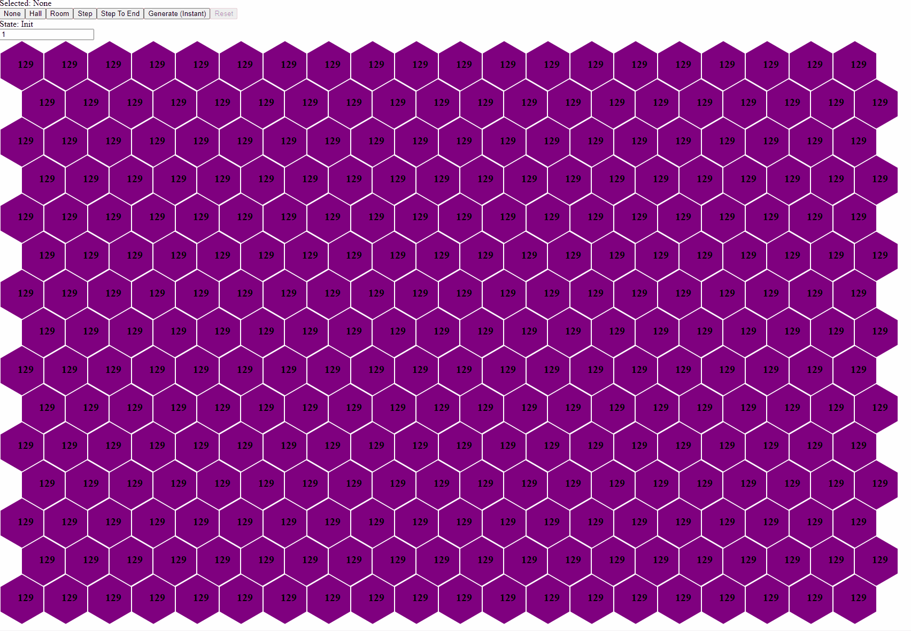

# Dungeoroo!

This is a test bed for dungeon generation using [Yew](https://yew.rs/).

## Building and Running

It's designed to be used with [trunk](https://trunkrs.dev/). The usual `trunk serve` and `trunk build` commands from the project root should work as expected.
